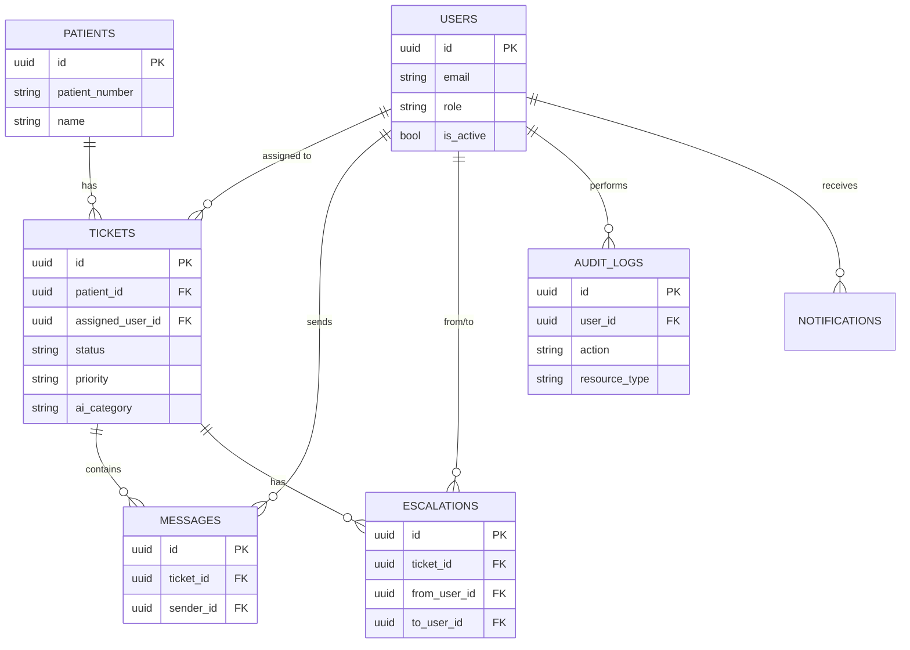

# Hospital Inquiry PoC

病院向け患者問い合わせ・エスカレーション管理システムのバックエンドAPI（PoC）です。

患者からの問い合わせをチケットとして管理し、看護師による初期対応、医師へのエスカレーション、SLA管理、KPI可視化までを一気通貫でサポートします。Claude APIによる問い合わせ自動分類も試験的に組み込んでいます。

> **Status**: Proof of Concept（本番未投入）。インターン応募・ポートフォリオ向けにセキュリティ・テスト面のブラッシュアップを実施中です。

## Demo

- API: TODO
- Frontend: TODO
- Demo Video: TODO

## Screenshots

> TODO: Add screenshots of Swagger UI, ticket list, and KPI dashboard.

## アプリ概要

病院・クリニックの患者問い合わせ対応を、電話・紙ベースの属人的な運用からデジタルなチケット管理に置き換えることを目指すPoCです。看護師が一次対応し、必要に応じて医師へエスカレーションする現場フローをそのままシステム化しています。

### 想定ユーザー

| ロール | 役割 |
|--------|------|
| patient | 問い合わせを送信する患者 |
| nurse | 問い合わせの一次対応・トリアージ |
| doctor | エスカレーションされた案件への対応 |
| admin | システム管理・KPI閲覧・監査ログ閲覧 |

## 主な機能

- 患者問い合わせのチケット管理（作成・更新・ステータス管理）
- ロールベースアクセス制御（RBAC: patient / nurse / doctor / admin）
- 看護師→医師へのエスカレーション
- AIによる問い合わせ自動分類・緊急度判定（補助的機能）
- SLA管理・超過アラート通知
- アプリ内通知
- KPIダッシュボード（チケット数・エスカレーション率など）
- 監査ログ（モデル定義済み・記録処理は拡充中、下記「既知の制限」参照）

## 技術スタック

| カテゴリ | 技術 |
|----------|------|
| Backend | FastAPI / Python 3.12 |
| Database | PostgreSQL 16 |
| Cache | Redis 7 |
| ORM | SQLAlchemy 2.0 (async) |
| Migration | Alembic |
| Auth | JWT (Access Token + Refresh Token) |
| AI | Anthropic Claude API |
| Container | Docker / Docker Compose |
| CI | GitHub Actions（Ruff + Pytest） |

## ER図（簡易）



## 認証・権限設計

### 認証方式

- JWT（HS256）による Access Token（30分） + Refresh Token（7日）方式
- パスワードは bcrypt でハッシュ化して保存

### ロールと権限昇格対策

**`POST /auth/register` は常に `patient` ロールでユーザーを作成します。** リクエストボディに `role` を含めても無視されます（`UserCreate` スキーマに `role` フィールドを持たせていないため）。

`nurse` / `doctor` / `admin` などの医療スタッフ・管理者ロールは、自己登録経由では一切作成できません。現状のPoCでは、こうしたロールはデータベースへの直接操作（シードスクリプトや管理者による手動付与）で作成する運用を想定しています。本番化の際は、管理者専用のユーザー作成API、または病院側の招待制フローを設ける必要があります（下記「今後の改善予定」参照）。

### アクセス制御一覧

| エンドポイント | 許可ロール |
|----------------|-----------|
| `POST /patients` | nurse, admin |
| `GET /patients`, `GET /patients/{id}` | nurse, doctor, admin |
| `GET /tickets` | nurse, doctor, admin（**patientは403**） |
| `PATCH /tickets/{id}` | nurse, doctor, admin |
| `POST /tickets/{id}/escalate` | nurse, admin |
| `GET /kpi`, `GET /audit-logs` | admin |
| `POST /admin/check-sla` | admin |

## セットアップ方法

### 必要なもの

- Docker Desktop
- Git

### 手順

```bash
git clone https://github.com/SayokoAkiike/hospital-inquiry-poc.git
cd hospital-inquiry-poc

# 環境変数を設定（実値は .env に書き、Gitにコミットしない）
cp .env.example .env
# .env の ANTHROPIC_API_KEY を設定

docker compose up -d
docker compose exec api alembic upgrade head
```

起動後:
- API: http://localhost:8000
- Swagger UI: http://localhost:8000/docs（`DEBUG=true` の場合のみ）

## API概要

| メソッド | パス | 説明 |
|---------|------|------|
| POST | /api/v1/auth/register | 患者の自己登録（常にpatientロール） |
| POST | /api/v1/auth/login | ログイン |
| POST | /api/v1/auth/refresh | トークン更新 |
| GET/POST | /api/v1/patients | 患者一覧・作成 |
| GET/POST | /api/v1/tickets | チケット一覧・作成 |
| PATCH | /api/v1/tickets/{id} | チケット更新 |
| POST | /api/v1/tickets/{id}/escalate | エスカレーション |
| GET/POST | /api/v1/tickets/{id}/messages | メッセージ |
| GET | /api/v1/kpi | KPIダッシュボード |
| GET | /api/v1/audit-logs | 監査ログ |
| GET | /api/v1/notifications | 通知一覧 |
| POST | /api/v1/admin/check-sla | SLAチェック実行 |

## セキュリティ上の注意

- **秘密情報**: `SECRET_KEY` / `POSTGRES_PASSWORD` / `ANTHROPIC_API_KEY` などの実値は `.env` に記載し、絶対にGitへコミットしないこと。漏洩した場合は直ちに無効化・再発行すること
- **本番起動時の安全弁**: `APP_ENV=production` の状態で、デフォルトの `SECRET_KEY`、`DEBUG=true`、デフォルトの `POSTGRES_PASSWORD` のいずれかが残っている場合、アプリは起動時に `RuntimeError` で即座に停止します（誤って危険な設定のまま本番公開されることを防ぐため）
- **role escalation対策**: 自己登録APIは常に `patient` ロール固定。管理者・医療スタッフロールは自己登録経由で取得不可能
- **患者データアクセス制御**: `patient` ロールは `/patients` 系エンドポイントに一切アクセス不可（403）。現状は「医療スタッフなら全患者を閲覧可能」という粗い制御であり、担当患者単位の制御は未実装（下記「既知の制限」参照）
- **AI利用方針**: Claude APIによる分類はあくまで補助。緊急度の最終判断・医療的な意思決定はスタッフが行うことを前提とする

## 環境変数一覧

| 変数名 | 説明 | 例 |
|--------|------|----|
| `APP_ENV` | `development` / `production` | `development` |
| `DEBUG` | Swagger UI公開フラグ。本番では`false`必須 | `true` |
| `SECRET_KEY` | JWT署名鍵。本番では`secrets.token_hex(32)`で生成 | - |
| `DATABASE_URL` | PostgreSQL接続文字列 | `postgresql+asyncpg://...` |
| `REDIS_URL` | Redis接続文字列 | `redis://localhost:6379/0` |
| `ANTHROPIC_API_KEY` | Claude API キー | - |
| `SLA_LOW/NORMAL/HIGH/URGENT` | 優先度別SLA時間（時間単位） | `72/24/4/1` |

詳細は `.env.example` を参照してください。

## テスト実行

```bash
docker compose exec api python -m pytest tests/ -v
```

### テスト構成

- `tests/integration/test_auth.py`: 認証・role escalation防止・トークンリフレッシュ
- `tests/integration/test_patients.py`: 患者データへのアクセス制御（RBAC）
- `tests/integration/test_tickets.py`: チケットの基本操作・アクセス制御
- `tests/unit/test_security.py`: パスワードハッシュ・JWT
- `tests/unit/test_config_safety.py`: 本番環境の危険なデフォルト設定の拒否

## CI/CD

GitHub Actions により `main` ブランチへの Push / PR 時に自動実行：

- Ruff によるLintチェック
- Pytest によるテスト実行（PostgreSQL / Redis サービスコンテナ使用）

## 既知の制限（Current Limitations）

This project is an early-stage backend PoC and is not production-ready.

Known limitations:
- This system is not intended for clinical decision-making.
- AI-based classification is experimental and must be reviewed by human staff.
- PHI/PII should not be sent to external AI APIs without masking or explicit governance. The current AI service sends ticket title/description as-is; PII masking is not yet implemented (see "今後の改善予定").
- Row-level access control currently distinguishes only between `patient` (no access) and medical staff (`nurse`/`doctor`/`admin`, full access to all patients/tickets). Per-assignment scoping (e.g., a doctor seeing only their escalated tickets) is not yet enforced.
- Audit logging models (`AuditLog`) exist, but write calls are not yet wired into all key operations (login, ticket changes, escalations). Further work is needed before this can be relied on for compliance purposes.
- There is no admin-only user creation API yet; staff accounts (`nurse`/`doctor`/`admin`) must currently be provisioned via direct database access.
- Integration with hospital systems such as EHR/EMR, appointment systems, and call center systems is out of scope for this PoC.
- No rate limiting or brute-force protection on authentication endpoints.

## 今後の改善予定

| 優先度 | 項目 |
|--------|------|
| 高 | 監査ログの実書き込み（login / ticket操作 / エスカレーション等への組み込み） |
| 高 | 管理者専用のユーザー作成API（招待制によるnurse/doctor/admin付与） |
| 高 | 担当者単位の行レベルアクセス制御（doctorは自分の担当チケットのみ等） |
| 中 | AI送信前のPII/PHIマスキング処理 |
| 中 | 認証エンドポイントへのレートリミット |
| 低 | EHR/EMR等の外部システム連携 |

## ライセンス

MIT License
